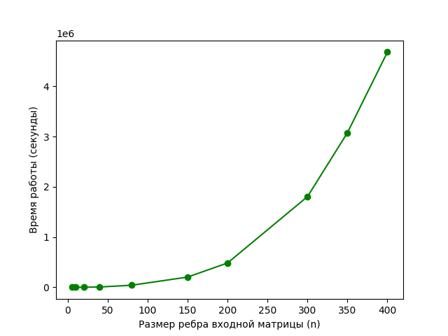
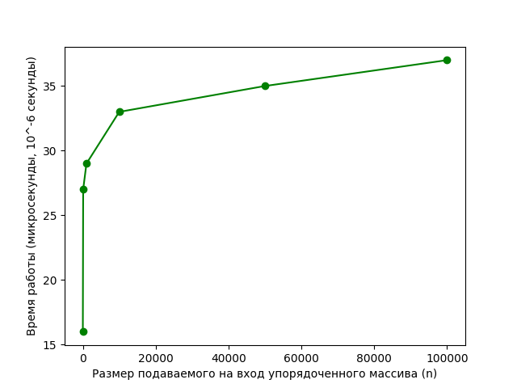
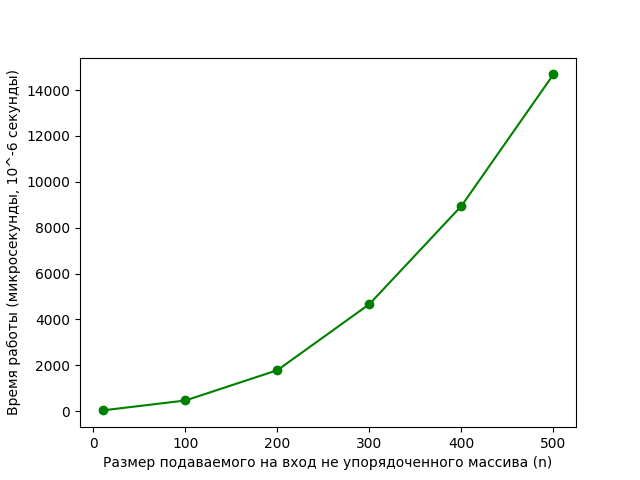
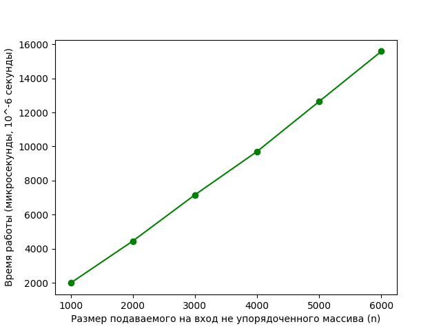

## Отчет о времени работы при увеличении входных данных

### Окружение: 
* ОС: macOC, 13.1
* CPU: M2
* CPU count: 8
* RAM: 8Gb

### Методика измерений:
Для каждого набора данных выполнялось 10 замеров времени исполения с помощью модуля datetime.
Итоговое значение считалось как среднее арифметическое за 10 прогонов.

Для проведения анализа взял несколько алгоритмов разной сложности:
1) Мое решение последней задачи из курса "8 задач" - O(n^3).

---
2) Алгоритм бинарного поиска в отстортированном массиве - O(log n).

---
3) Сортировка пузырьком - O(n^2).

---
4) Пирамидальная сортировка - O(n log(n)).

---

Вывод: Сравнив графики функций сложности O() 
и фактические графики зависимостей времени исполнения кода от размера подаваемых данных
можно обнаружить близкое соответствие между ними.
